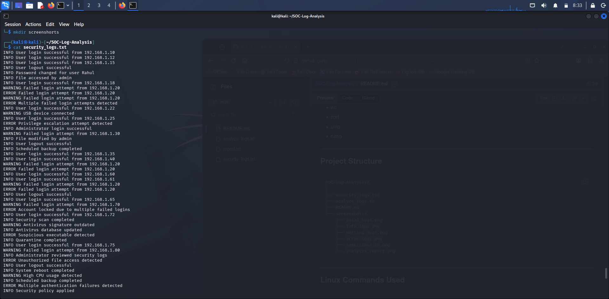
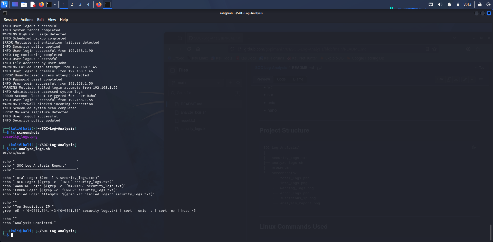
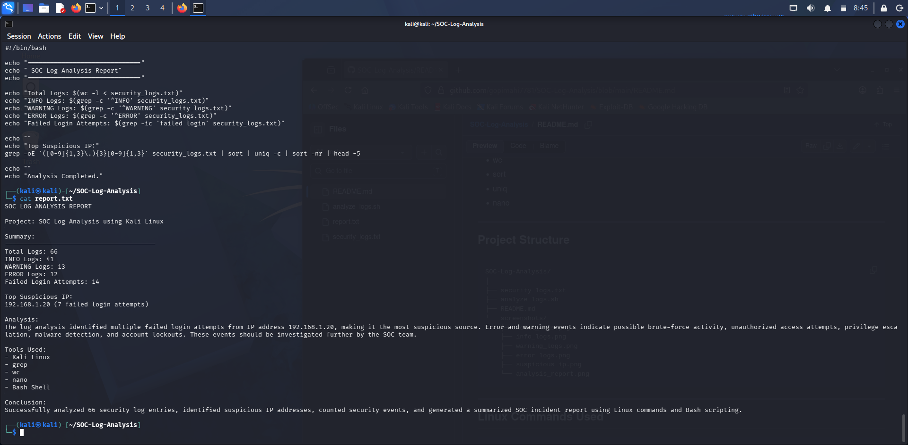
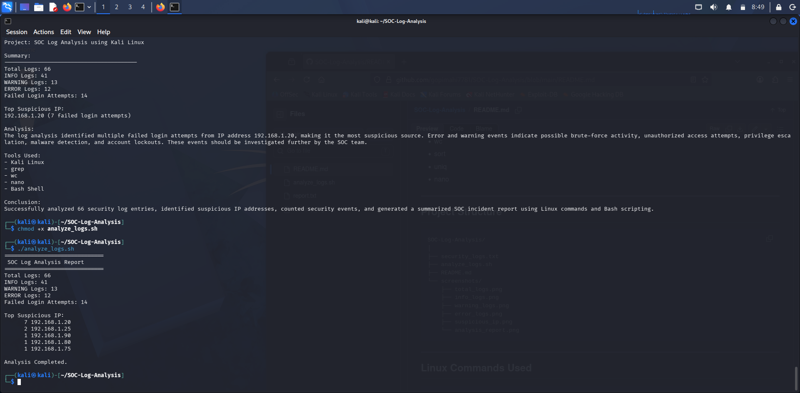

# SOC Log Analysis and Incident Detection

## Project Overview

This project simulates the responsibilities of a Tier-1 Security Operations Center (SOC) Analyst by analyzing security logs in a Linux environment. The objective is to identify suspicious activities, investigate security events, and automate log analysis using Bash scripting.

---

## Features

- Analyzed **66+ simulated security log entries**
- Identified **INFO, WARNING, and ERROR** events
- Detected repeated failed login attempts
- Identified suspicious IP addresses
- Investigated privilege escalation attempts
- Detected malware-related events
- Identified administrator login activities
- Automated security log analysis using a Bash script
- Generated a summarized SOC analysis report

---

## Technologies Used

- Kali Linux
- Bash Scripting
- Linux Command Line
- grep
- wc
- sort
- uniq
- nano

---

## Project Structure

```text
SOC-Log-Analysis/
│
├── security_logs.txt
├── analyze_logs.sh
├── README.md
└── screenshots/
    ├── total_logs.png
    ├── info_logs.png
    ├── warning_logs.png
    ├── error_logs.png
    ├── suspicious_ip.png
    └── analysis_report.png
```

---

## Linux Commands Used

```bash
wc -l security_logs.txt

grep "^INFO" security_logs.txt

grep "^WARNING" security_logs.txt

grep "^ERROR" security_logs.txt

grep -i "FAILED login" security_logs.txt

grep "192.168.1.20" security_logs.txt

grep -oE '([0-9]{1,3}\.){3}[0-9]{1,3}' security_logs.txt | sort | uniq -c | sort -nr
```

---

## Automated Analysis Report

The Bash script automatically generates the following report:

```text
SOC Log Analysis Report

Total Logs: 66
INFO Logs: 41
WARNING Logs: 13
ERROR Logs: 12
Failed Login Attempts: 14

Top Suspicious IP:
192.168.1.20
```

---

## Skills Demonstrated

- Security Log Analysis
- Incident Detection
- Linux Administration
- Bash Scripting
- Threat Hunting
- IOC Identification
- Security Event Investigation
- Tier-1 SOC Workflow
- Log Correlation

---

## Future Enhancements

- Real-time log monitoring
- CSV/PDF report generation
- Email alert notifications
- Splunk SIEM integration
- ELK Stack integration
- Severity-based log classification

---

## Author

**Gopi Krishna Reddy**

Cyber Security Enthusiast | SOC Analyst Aspirant
## Screenshots

### Security Logs


### Analyze Script


### Analysis Report


### SOC Analysis Output

